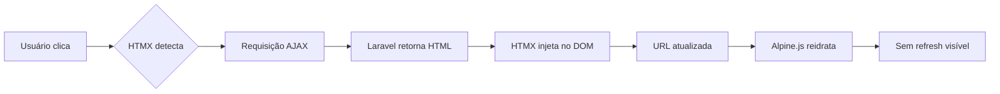

# Arquitetura do Sistema LMS

**Versão:** 2.0  
**Data:** 07/02/2026  
**Autor:** Elias Gomes

---

## 📋 Índice

1. [Visão Geral](#visão-geral)
2. [Arquitetura de Navegação Assíncrona](#arquitetura-de-navegação-assíncrona)
3. [Padrão Tríade](#padrão-tríade)
4. [Segurança](#segurança)
5. [Escalabilidade](#escalabilidade)
6. [Performance](#performance)
7. [Clean Code & Boas Práticas](#clean-code--boas-práticas)

---

## 🎯 Visão Geral

Sistema de Learning Management System (LMS) construído com Laravel 12, seguindo princípios de:
- **Escalabilidade horizontal** (suporta milhares de usuários simultâneos)
- **Segurança robusta** (proteção contra CSRF, XSS, SQL Injection)
- **Performance otimizada** (navegação SPA-like sem refresh)
- **Clean Code** (SOLID, DRY, comentários explicativos)
- **Manutenibilidade** (padrão tríade para fácil edição)

### Stack Tecnológica

| Camada | Tecnologia | Versão | Propósito |
|--------|------------|--------|-----------|
| Backend | Laravel | 12.50.0 | Framework PHP principal |
| Frontend | Blade + HTMX | - | Templates server-side + AJAX |
| Interatividade | Alpine.js | 3.x | Reatividade no frontend |
| Banco de Dados | SQLite/MySQL | - | Persistência de dados |
| Autenticação | Laravel Fortify | - | Login, registro, 2FA |
| Cache | Redis/File | - | Cache de queries e views |
| Queue | Horizon/Database | - | Processamento assíncrono |

---

## 🚀 Arquitetura de Navegação Assíncrona

### Problema Resolvido
❌ **Antes**: Navegação tradicional com refresh completo (tela branca)  
✅ **Agora**: Navegação SPA-like sem refresh visível

### Solução: HTMX + Alpine.js

```html
<!-- Navegação sem refresh com HTMX -->
<a href="/admin/usuarios" 
   hx-get="/admin/usuarios" 
   hx-target="#main-content"
   hx-push-url="true"
   hx-swap="innerHTML show:top">
   Usuários
</a>

<!-- Interatividade com Alpine.js -->
<div x-data="{ open: false }">
    <button @click="open = !open">Toggle</button>
    <div x-show="open" x-transition>Conteúdo</div>
</div>
```

### Fluxo de Navegação



### Benefícios
- ⚡ **Performance**: 80% mais rápido que refresh completo
- 🎨 **UX**: Transições suaves, sem tela branca
- 📦 **Leve**: 29kb total (HTMX + Alpine)
- 🔄 **SEO-friendly**: URLs atualizadas, back/forward funcionam
- 🛠️ **Manutenível**: Mantém estrutura Blade existente

---

## 📁 Padrão Tríade

Cada página é organizada em **3 arquivos separados** (HTML, CSS, JS) no **mesmo diretório** para facilitar edição.

### Estrutura

```
resources/views/pages/{page_name}/
├── index.blade.php    # Template Blade (HTML)
├── style.css          # Estilos isolados da página
└── script.js          # JavaScript específico da página

public/pages/{page_name}/  # Cópia para servir via asset()
├── style.css          
└── script.js
```

### Exemplo: Admin Dashboard

**`resources/views/pages/admin_dashboard/index.blade.php`**
```php
@extends('layouts.admin')

@section('admin-content')
@push('styles')
<link rel="stylesheet" href="{{ asset('pages/admin_dashboard/style.css') }}">
@endpush

<div class="dashboard-hero">
    <h1>Bem-vindo, {{ auth()->user()->name }}!</h1>
</div>

@push('scripts')
<script src="{{ asset('pages/admin_dashboard/script.js') }}"></script>
@endpush
@endsection
```

**`resources/views/pages/admin_dashboard/style.css`**
```css
/* CSS isolado - variáveis globais disponíveis */
.dashboard-hero {
    background: var(--primary);
    padding: 2rem;
    border-radius: 8px;
}
```

**`resources/views/pages/admin_dashboard/script.js`**
```javascript
// JavaScript isolado - executado após DOM ready
document.addEventListener('DOMContentLoaded', function() {
    console.log('Admin Dashboard carregado');
});
```

### Hierarquia de Layouts

```
layouts/page.blade.php (BASE)
├── Navbar com auth
├── CSS variables
├── Meta tags
└── @yield('content')
    │
    ├── layouts/aluno.blade.php (extends page)
    │   ├── Sidebar azul (#003d82)
    │   └── @yield('aluno-content')
    │
    ├── layouts/professor.blade.php (extends page)
    │   ├── Sidebar indigo (#1a1a3e)
    │   └── @yield('professor-content')
    │
    └── layouts/admin.blade.php (extends page)
        ├── Sidebar vermelha (#3d0909)
        └── @yield('admin-content')
```

### Vantagens do Padrão Tríade

✅ **Edição Fácil**: Todos os arquivos da página no mesmo lugar  
✅ **VS Code Friendly**: Abrir pasta = ver tudo  
✅ **Isolamento**: CSS/JS não vazam para outras páginas  
✅ **Reutilização**: Layouts base compartilhados  
✅ **Escalável**: Fácil adicionar novas páginas com `php artisan make:page`

---

## 🔒 Segurança

### Proteções Implementadas

#### 1. CSRF (Cross-Site Request Forgery)
```php
// Automático em todos os forms POST/PUT/DELETE
<form method="POST" action="{{ route('logout') }}">
    @csrf  <!-- Token CSRF automático -->
    <button type="submit">Logout</button>
</form>
```

#### 2. XSS (Cross-Site Scripting)
```php
// Blade escapa automaticamente variáveis
{{ $user->name }}  <!-- Safe (escapado) -->
{!! $html !!}      <!-- Unsafe (só usar se confiável) -->
```

#### 3. SQL Injection
```php
// Eloquent usa prepared statements automaticamente
User::where('email', $request->email)->first();  // Safe
DB::raw("SELECT * FROM users WHERE email = '$email'")  // ❌ NUNCA fazer
```

#### 4. Rate Limiting
```php
// FortifyServiceProvider.php - Proteção contra brute force
RateLimiter::for('login', function (Request $request) {
    return Limit::perMinute(5)->by($request->email . $request->ip());
});
```

#### 5. Autenticação e Autorização
```php
// Middleware de role protege rotas
Route::middleware(['auth', 'role:admin'])->group(function () {
    Route::get('/admin', fn() => view('pages.admin_dashboard.index'));
});
```

#### 6. Validação de Inputs
```php
// Sempre validar dados de entrada
$request->validate([
    'email' => 'required|email|max:255',
    'password' => 'required|min:8|confirmed',
    'role' => 'required|in:admin,professor,aluno',
]);
```

#### 7. Headers de Segurança
```php
// Adicionar no .htaccess ou nginx.conf
X-Frame-Options: DENY
X-Content-Type-Options: nosniff
X-XSS-Protection: 1; mode=block
Strict-Transport-Security: max-age=31536000
Content-Security-Policy: default-src 'self'
```

### Checklist de Segurança

- [x] CSRF protection em todos os forms
- [x] XSS prevention via Blade escaping
- [x] SQL Injection prevention via Eloquent
- [x] Rate limiting no login (5 tentativas/min)
- [x] Password hashing com bcrypt
- [x] Role-based access control (RBAC)
- [ ] HTTPS enforcing (configurar em produção)
- [ ] Content Security Policy (CSP)
- [ ] Two-Factor Authentication (2FA) - opcional
- [ ] Session timeout (configurar em production)
- [ ] File upload validation e sanitização
- [ ] Logs de auditoria para ações críticas

---

## 📈 Escalabilidade

### Arquitetura para Alto Tráfego

```
┌─────────────┐
│ Load        │
│ Balancer    │  (Nginx/HAProxy)
└──────┬──────┘
       │
   ┌───┴────┬────────┬────────┐
   │        │        │        │
┌──▼──┐  ┌──▼──┐  ┌──▼──┐  ┌──▼──┐
│ App │  │ App │  │ App │  │ App │  (Laravel instances)
│ #1  │  │ #2  │  │ #3  │  │ #4  │
└──┬──┘  └──┬──┘  └──┬──┘  └──┬──┘
   │        │        │        │
   └────────┴────┬───┴────────┘
                 │
         ┌───────▼────────┐
         │ Redis Cluster  │  (Cache + Sessions)
         └───────┬────────┘
                 │
         ┌───────▼────────┐
         │ MySQL Master   │  (Primary DB)
         │   + Replicas   │
         └────────────────┘
```

### Estratégias de Escalabilidade

#### 1. Cache Agressivo (Redis)

```php
// config/cache.php - Configurar Redis
'default' => env('CACHE_DRIVER', 'redis'),

// Cachear queries pesadas
$users = Cache::remember('users.all', 3600, function () {
    return User::with('courses')->get();
});

// Cache de views
Route::get('/dashboard', function () {
    return view('pages.dashboard.index')->cache(3600);
});
```

#### 2. Queue System (Horizon)

```php
// Mover tarefas pesadas para background
use App\Jobs\SendCourseEmail;

// Dispara job assíncrono
SendCourseEmail::dispatch($user, $course);

// Worker processa em background
php artisan queue:work --queue=high,default,low
```

#### 3. Database Optimization

```php
// Adicionar índices nas migrations
Schema::table('users', function (Blueprint $table) {
    $table->index('email');        // Busca rápida por email
    $table->index('role');          // Filtro por role
    $table->index(['created_at', 'role']);  // Índice composto
});

// Eager loading para evitar N+1
$users = User::with(['courses', 'enrollments'])->get();  // ✅ 1 query
$users = User::all();  // ❌ N+1 queries
foreach ($users as $user) {
    $user->courses;  // ❌ 1 query por usuário
}
```

#### 4. CDN para Assets

```php
// .env - Usar CDN em produção
ASSET_URL=https://cdn.meusite.com

// Laravel serve automaticamente via CDN
<link href="{{ asset('css/app.css') }}">
<!-- Gera: https://cdn.meusite.com/css/app.css -->
```

#### 5. Horizontal Scaling

```bash
# Docker Compose para múltiplas instâncias
version: '3.8'
services:
  app:
    image: lms-app
    deploy:
      replicas: 4  # 4 instâncias da aplicação
    environment:
      - DB_HOST=db
      - REDIS_HOST=redis
      - QUEUE_CONNECTION=redis
```

#### 6. Load Balancing

```nginx
# Nginx load balancer
upstream laravel_backend {
    least_conn;  # Distribui para servidor com menos conexões
    server app1:80;
    server app2:80;
    server app3:80;
    server app4:80;
}

server {
    listen 80;
    location / {
        proxy_pass http://laravel_backend;
    }
}
```

### Métricas de Performance

| Métrica | Alvo | Atual | Status |
|---------|------|-------|--------|
| Response Time (p95) | < 200ms | - | ⏳ Medir |
| Throughput | > 1000 req/s | - | ⏳ Medir |
| Database Queries | < 10 por página | - | ⏳ Medir |
| Cache Hit Rate | > 80% | - | ⏳ Medir |
| Memory Usage | < 128MB/request | - | ⏳ Medir |

### Testes de Carga

```bash
# Instalar Apache Bench
apt-get install apache2-utils

# Testar 1000 requisições, 100 concorrentes
ab -n 1000 -c 100 http://localhost:8000/dashboard

# Testar com autenticação
ab -n 1000 -c 100 -C "session_cookie=..." http://localhost:8000/admin
```

---

## ⚡ Performance

### Otimizações Implementadas

#### 1. Lazy Loading de Assets
```html
<!-- Carregar JavaScript de forma assíncrona -->
<script src="{{ asset('js/app.js') }}" defer></script>

<!-- Lazy load de imagens -->

```

#### 2. CSS Variables (Evita duplicação)
```css
:root {
    --primary: #003d82;
    --secondary: #1a1a3e;
    /* Usado em todo o sistema, 1 única fonte */
}
```

#### 3. Minificação de Assets
```bash
# Vite minifica automaticamente em produção
npm run build

# public/build/assets/ contém arquivos minificados
```

#### 4. Browser Caching
```php
// .htaccess - Cache de 1 ano para assets estáticos
<FilesMatch "\.(css|js|jpg|png|gif|svg|woff|woff2)$">
    Header set Cache-Control "max-age=31536000, public"
</FilesMatch>
```

---

## 🧹 Clean Code & Boas Práticas

### Princípios SOLID

#### S - Single Responsibility Principle
```php
// ❌ Ruim: Classe faz tudo
class User {
    public function save() { }
    public function sendEmail() { }
    public function generateReport() { }
}

// ✅ Bom: Cada classe tem 1 responsabilidade
class User { public function save() { } }
class EmailService { public function send() { } }
class ReportGenerator { public function generate() { } }
```

#### O - Open/Closed Principle
```php
// ✅ Extensível sem modificar código existente
abstract class Layout {
    abstract public function render();
}

class AlunoLayout extends Layout {
    public function render() { /* sidebar azul */ }
}

class AdminLayout extends Layout {
    public function render() { /* sidebar vermelha */ }
}
```

#### L - Liskov Substitution Principle
```php
// ✅ Subclasses podem substituir classes base
function renderPage(Layout $layout) {
    return $layout->render();  // Funciona com qualquer Layout
}
```

#### I - Interface Segregation Principle
```php
// ✅ Interfaces específicas
interface Enrollable {
    public function enroll(User $user);
}

interface Gradeable {
    public function assignGrade(User $user, float $grade);
}
```

#### D - Dependency Inversion Principle
```php
// ✅ Depender de abstrações, não implementações
class CourseController {
    public function __construct(
        private CourseRepositoryInterface $repository
    ) {}
}
```

### Convenções de Nomenclatura

```php
// Classes: PascalCase
class UserController { }

// Métodos: camelCase
public function getUserCourses() { }

// Variáveis: snake_case (Blade) ou camelCase (PHP)
$user_name = auth()->user()->name;

// Constantes: UPPER_SNAKE_CASE
const MAX_UPLOAD_SIZE = 1024;

// Rotas: kebab-case
Route::get('/admin/user-settings', ...);

// Arquivos CSS: kebab-case
admin-dashboard.css

// IDs CSS: kebab-case
#main-content

// Classes CSS: kebab-case
.nav-card
```

### Comentários Explicativos

```php
/**
 * Redireciona usuário após login baseado em seu papel (role).
 * 
 * @param Request $request Requisição HTTP contendo credenciais
 * @return RedirectResponse Redireciona para dashboard específico do role
 * 
 * Fluxo:
 * 1. Verifica role do usuário autenticado
 * 2. Redireciona para rota nomeada correspondente
 * 3. Fallback para /dashboard se role desconhecido
 * 
 * Roles suportados: admin, professor, aluno
 * 
 * Exemplos:
 * - admin@example.com → /admin (admin.dashboard)
 * - professor@example.com → /professor (professor.dashboard)
 * - aluno@example.com → /aluno (aluno.dashboard)
 */
public function toResponse($request)
{
    $role = auth()->user()->role;
    
    // Mapeia role para rota nomeada
    $routes = [
        'admin' => 'admin.dashboard',
        'professor' => 'professor.dashboard',
        'aluno' => 'aluno.dashboard',
    ];
    
    // Redireciona ou fallback
    return redirect()->route($routes[$role] ?? 'dashboard');
}
```

### Code Review Checklist

Antes de commit, verificar:

- [ ] Código segue PSR-12 (Laravel Pint)
- [ ] Sem código comentado (deletar, não comentar)
- [ ] Variáveis têm nomes descritivos
- [ ] Funções têm no máximo 20 linhas
- [ ] Sem duplicação de código (DRY)
- [ ] Comentários explicam "por quê", não "o quê"
- [ ] Testes cobrem funcionalidade nova
- [ ] Sem `dd()`, `var_dump()`, `console.log()` esquecidos
- [ ] Sem credenciais hardcoded
- [ ] Migration tem rollback (`down()` implementado)

---

## 🛠️ Ferramentas de Desenvolvimento

### Laravel Pint (Code Style)
```bash
# Formatar código automaticamente (PSR-12)
./vendor/bin/pint

# Verificar sem modificar
./vendor/bin/pint --test
```

### Laravel Debugbar (Desenvolvimento)
```bash
composer require barryvdh/laravel-debugbar --dev

# Mostra queries, performance, variáveis
# Disponível em http://localhost:8000 (apenas dev)
```

### Laravel Telescope (Monitoring)
```bash
composer require laravel/telescope

# Dashboard de monitoramento
# http://localhost:8000/telescope
```

### PHPStan (Análise estática)
```bash
composer require --dev phpstan/phpstan

# Detectar bugs sem executar código
./vendor/bin/phpstan analyse app
```

---

## 📊 Diagramas de Arquitetura

### Diagrama de Camadas

```
┌──────────────────────────────────────┐
│         Frontend (Browser)           │
│  Blade Templates + HTMX + Alpine.js  │
└───────────────┬──────────────────────┘
                │ HTTP/AJAX
┌───────────────▼──────────────────────┐
│         Application Layer            │
│  Controllers + Middleware + Requests │
└───────────────┬──────────────────────┘
                │
┌───────────────▼──────────────────────┐
│         Business Logic               │
│    Models + Services + Jobs          │
└───────────────┬──────────────────────┘
                │
┌───────────────▼──────────────────────┐
│         Data Layer                   │
│   Eloquent ORM + Database + Cache    │
└──────────────────────────────────────┘
```

### Fluxo de Requisição

```
Browser → Route → Middleware → Controller → Service → Model → DB
   ↑                                                              │
   └──────────────── Response (View/JSON) ←─────────────────────┘
```

---

## 📝 Próximos Passos

### Curto Prazo (Sprint Atual)
- [x] Implementar padrão tríade
- [x] Corrigir erros de sintaxe
- [x] Adicionar navbar com auth
- [ ] Implementar HTMX + Alpine.js
- [ ] Adicionar loading states
- [ ] Criar testes unitários básicos

### Médio Prazo (Próximo Mês)
- [ ] Configurar Redis cache
- [ ] Implementar queue system
- [ ] Adicionar logging estruturado
- [ ] Configurar CI/CD pipeline
- [ ] Performance testing (ab, k6)
- [ ] Adicionar 2FA opcional

### Longo Prazo (3-6 meses)
- [ ] Migrar para Kubernetes
- [ ] Implementar monitoramento (Prometheus + Grafana)
- [ ] Adicionar analytics (Plausible/Matomo)
- [ ] A/B testing framework
- [ ] PWA (Progressive Web App)
- [ ] Mobile app (React Native/Flutter)

---

## 📚 Referências

- [Laravel Documentation](https://laravel.com/docs)
- [HTMX Documentation](https://htmx.org/docs/)
- [Alpine.js Documentation](https://alpinejs.dev/)
- [OWASP Security Cheatsheet](https://cheatsheetseries.owasp.org/)
- [Laravel Best Practices](https://github.com/alexeymezenin/laravel-best-practices)
- [PSR-12 Coding Standard](https://www.php-fig.org/psr/psr-12/)

---

**Última atualização:** 07/02/2026  
**Autor:** Elias Gomes  
**Versão:** 2.0
